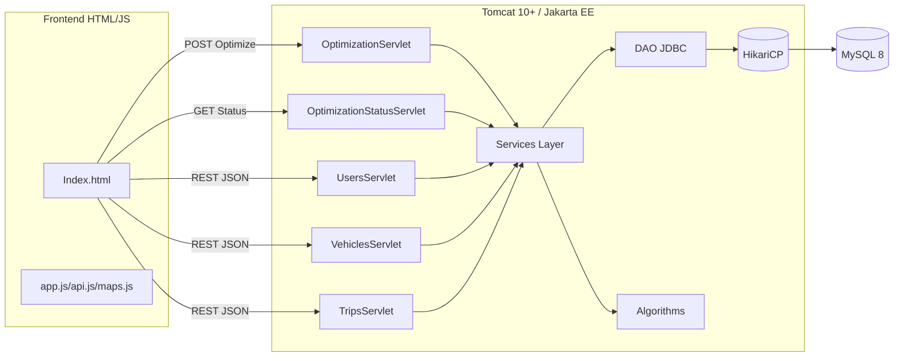

# Optimisation des trajets - Architecture Jakarta EE

Ce dépôt fournit une architecture modulaire complète pour une application web de covoiturage (Jakarta EE 10+, Tomcat 10+, MySQL 8, Frontend HTML/CSS/JS + Google Maps API).

Contenu livré:
- Diagramme d'architecture global (Mermaid)
- Structure détaillée des packages
- Schéma SQL MySQL
- Flux de données entre composants
- API des servlets (endpoints RESTful)
- Intégration des algorithmes et concurrence
- Patterns de conception recommandés
- Structure du frontend et workflow Google Maps

## Diagramme d'architecture

## Structure des packages
- com.covoiturage.models: User, Vehicle, Trip
- com.covoiturage.dao: interfaces DAO (UserDao, VehicleDao, TripDao)
- com.covoiturage.dao.jdbc: implémentations JDBC (UserDaoJdbc, VehicleDaoJdbc, TripDaoJdbc)
- com.covoiturage.services: UserService, VehicleService, TripService, OptimizationService
- com.covoiturage.algorithms: NearestNeighbor, InsertionHeuristic, SimulatedAnnealing, ConflictDetector
- com.covoiturage.servlets: UsersServlet, VehiclesServlet, TripsServlet, OptimizationServlet, OptimizationStatusServlet, BaseServlet
- com.covoiturage.utils: Database (HikariCP), JsonUtil, ValidationUtil

## Schéma de base de données
Voir db/schema.sql (MySQL 8). Tables: users, vehicles, trips, trip_passengers, avec clés étrangères et index.

## Flux de données (MVC)
1. Le frontend envoie des requêtes REST (JSON) vers les servlets.
2. Les servlets délèguent à la couche service (validation, logique métier, stats).
3. Les services accèdent aux DAO pour la persistance (HikariCP) et, pour l'optimisation, appellent les algorithmes.
4. Les résultats sont renvoyés au frontend pour affichage et visualisation.

## API REST (servlets)
- GET /api/users -> liste des utilisateurs
- GET /api/users/{id} -> détail utilisateur
- POST /api/users -> créer {name, startAddress, endAddress, preferences?, availability?}
- PUT /api/users -> mettre à jour (avec id)
- DELETE /api/users/{id} -> supprimer

- GET /api/vehicles
- GET /api/vehicles/{id}
- POST /api/vehicles -> {driverId, model, capacity, constraints?}
- PUT /api/vehicles
- DELETE /api/vehicles/{id}

- GET /api/trips
- GET /api/trips/{id}
- POST /api/trips -> {driverId, vehicleId, startAddress, endAddress, ...}
- PUT /api/trips
- DELETE /api/trips/{id}

- POST /api/optimize -> { users: User[], vehicles: Vehicle[] } 
  Renvoie: { jobId }
- GET /api/optimize/status/{jobId} -> { status: RUNNING|DONE|ERROR, result?: Trip[], conflicts?:[] }

## Intégration des algorithmes
- Construction initiale: NearestNeighbor.constructInitial(users, vehicles)
- Amélioration: InsertionHeuristic.improve(trips)
- Optimisation globale: SimulatedAnnealing.optimize(trips)
- Détection de conflits: ConflictDetector.detect(trips, vehicles)

Ces modules sont orchestrés par OptimizationService, exécuté de manière asynchrone via ExecutorService (pool fixe). Chaque exécution crée un jobId et peut être interrogée via OptimizationStatusServlet.

## Concurrence et exécutions longues
- ExecutorService avec N threads (N = max(2, CPU/2)).
- Registre de jobs ConcurrentHashMap<jobId, Future>.
- Accès DB via HikariCP (pool de connexions) pour éviter le blocage.
- Les servlets restent non bloquants côté client via polling.

## Patterns de conception
- MVC (Servlets = Controller, JSP/HTML = View, Services/DAO = Model & Business)
- DAO pattern + Repository style pour la persistance
- Service layer pour la logique métier
- Strategy pour interchanger d'heuristiques (interfaces d'optimisation)
- Factory (implémentable) pour choisir l'algorithme selon la taille des données
- DTO pour les réponses d'optimisation (JobStatus)

## Frontend
Arborescence:
- src/main/webapp/index.html
- src/main/webapp/css/styles.css
- src/main/webapp/js/api.js
- src/main/webapp/js/maps.js
- src/main/webapp/js/app.js

Fonctionnalités:
- Boutons pour charger les données et lancer l'optimisation
- Carte Google Maps (#map) pour afficher les points de départ/arrivée et les trajets optimisés
- Intégration Distance Matrix API à implémenter côté serveur (appel HTTP) ou client selon les quotas

## Workflow Google Maps API
1. Frontend charge l'API (clé dans index.html).
2. maps.js initialise la carte et expose Maps.addMarker().
3. Après optimisation, le frontend traduit les adresses en coordonnées (via Geocoding/Places) puis place les marqueurs et polyline.
4. Le backend peut interroger Distance Matrix API pour calculer distances/temps et enrichir Trip.totalDistanceKm / totalDurationMin.

## Sécurité basique
- Validation des inputs côté serveur (ValidationUtil)
- JSON uniquement, content-type vérifié côté client
- Échapper/valider les IDs et champs texte

## Build & déploiement
- mvn clean package -> génère un .war
- Déployer sur Tomcat 10+ (contexte /)
- Configurer variables d'environnement DB_URL, DB_USER, DB_PASS si nécessaire